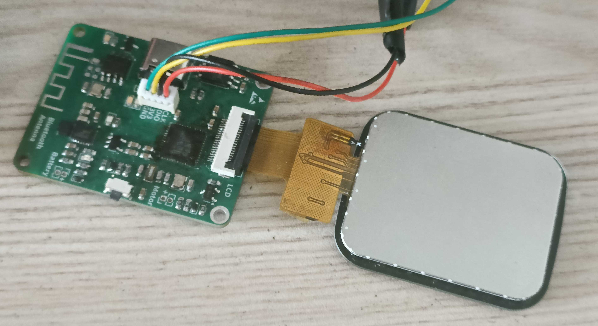

# 基于 STM32 的智能手环设计

> 本项目受到 [OV-Watch](https://github.com/No-Chicken/OV-Watch) 的启发，在原有基础上进行了较大的改动。

本项目旨在设计一套能够进行多任务管理、图形化界面、环境感知、无线通信等功能的智能手环

项目基于 STM32F411CEU6 主控芯片，软件架构使用 FreeRTOS + LVGL + LittleFS 

使用 CMake + Ninja 构建编译， arm-none-eabi-gcc 编译工具链， openocd 烧录，采用 C23 及 C++23 标准编译

**软件硬件均是原创设计**
**硬件部分暂无开源的打算**

